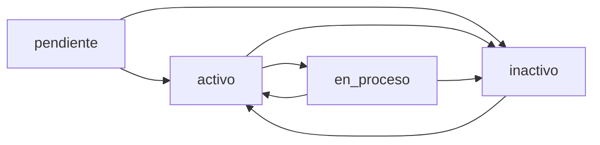

## Overview

The `Solicitud` model manages survey requests for colonies with a sophisticated state machine, preventing duplicate active requests and enforcing valid state transitions.

## Fields

<ParamField path="id" type="AutoField" required>
  Primary key automatically generated
</ParamField>

<ParamField path="colonia" type="ForeignKey" required>
  Colony for which the survey is requested
  - **Related to**: `Colonia` model
  - **On delete**: CASCADE (deletes solicitud if colony is deleted)
  - **Related name**: `solicitudes`
</ParamField>

<ParamField path="tipo" type="string" required>
  Type of survey request
  - **Choices**:
    - `nuevo`: New survey
    - `actualizacion`: Data update
  - **Default**: `nuevo`
  - **Max length**: 20 characters
</ParamField>

<ParamField path="estado" type="string" required>
  Current state of the request
  - **Choices**:
    - `pendiente`: Pending approval
    - `activo`: Active (approved)
    - `en_proceso`: In survey process
    - `inactivo`: Inactive (cancelled/completed)
  - **Default**: `pendiente`
  - **Max length**: 30 characters
</ParamField>

<ParamField path="creado_por" type="ForeignKey">
  User who created the request
  - **Related to**: `User` model
  - **On delete**: SET_NULL
  - **Nullable**: Yes
  - **Related name**: `solicitudes_creadas`
</ParamField>

<ParamField path="fecha_creacion" type="DateTime" required>
  Timestamp when the request was created
  - **Default**: Current time (timezone.now)
</ParamField>

<ParamField path="fecha_actualizacion" type="DateTime">
  Timestamp of last update
  - **Auto-updated**: Yes (auto_now=True)
</ParamField>

<ParamField path="observaciones" type="text">
  Additional observations or notes
  - **Blank**: Yes (optional)
</ParamField>

## State Machine

The `Solicitud` model implements a state machine with controlled transitions.

### State Constants

```python
ESTADO_PENDIENTE = "pendiente"
ESTADO_ACTIVO = "activo"
ESTADO_EN_PROCESO = "en_proceso"
ESTADO_INACTIVO = "inactivo"
```

### State Transition Diagram



### Allowed Transitions

| From State | To States |
|------------|----------|
| `pendiente` | `activo`, `inactivo` |
| `activo` | `en_proceso`, `inactivo` |
| `en_proceso` | `activo`, `inactivo` |
| `inactivo` | `activo` |

## Methods

### `puede_transicionar(nuevo_estado)`

Validates if a state transition is allowed.

```python
def puede_transicionar(self, nuevo_estado):
    allowed = {
        self.ESTADO_PENDIENTE: [self.ESTADO_ACTIVO, self.ESTADO_INACTIVO],
        self.ESTADO_ACTIVO: [self.ESTADO_EN_PROCESO, self.ESTADO_INACTIVO],
        self.ESTADO_EN_PROCESO: [self.ESTADO_ACTIVO, self.ESTADO_INACTIVO],
        self.ESTADO_INACTIVO: [self.ESTADO_ACTIVO],
    }
    return nuevo_estado in allowed.get(self.estado, [])
```

**Parameters**:
- `nuevo_estado` (str): The target state to transition to

**Returns**: Boolean indicating if transition is allowed

### `clean()`

Validates the request before saving.

```python
def clean(self):
    # Validar existencia de colonia
    if not self.colonia:
        raise ValidationError(
            "La solicitud debe estar vinculada a una colonia.")
    
    # Evitar duplicados: misma colonia, mismo tipo y estado no inactivo
    qs = Solicitud.objects.filter(colonia=self.colonia, tipo=self.tipo)
    if self.pk:
        qs = qs.exclude(pk=self.pk)
    if qs.filter(estado__in=[self.ESTADO_PENDIENTE, self.ESTADO_ACTIVO, self.ESTADO_EN_PROCESO]).exists():
        raise ValidationError(
            "Ya existe una solicitud activa o pendiente para esta colonia y tipo.")
```

**Validation Rules**:
1. Colony must be specified
2. Prevents duplicate active requests for same colony and type
3. Only one active/pending/in-process request allowed per colony+type combination

### `__str__()`

Returns string representation with ID, colony, and state.

```python
def __str__(self):
    return f"Solicitud #{self.pk} - {self.colonia} ({self.get_estado_display()})"
```

**Returns**: String like "Solicitud #5 - Colonia Ejemplo (Activo)"

## Relationships

### Foreign Keys
- **colonia**: Links to the `Colonia` being surveyed
- **creado_por**: Links to the `User` who created the request

### Reverse Relationships
- **relevamientos**: Survey records associated with this request (via `Relevamiento.solicitud` ForeignKey)
- **auditorias**: Audit trail of state changes (via `SolicitudAudit.solicitud` ForeignKey)

## Meta Options

```python
class Meta:
    verbose_name = "Solicitud de relevamiento"
    verbose_name_plural = "Solicitudes de relevamiento"
    ordering = ["-fecha_creacion"]
```

### Ordering
Requests are ordered by creation date in descending order (newest first).

## Complete Model Definition

```python
from django.db import models
from django.core.exceptions import ValidationError
from django.utils import timezone
from django.conf import settings

User = settings.AUTH_USER_MODEL

class Solicitud(models.Model):
    TIPO_CHOICES = [
        ("nuevo", "Nuevo relevamiento"),
        ("actualizacion", "Actualización de datos")
    ]
    ESTADO_PENDIENTE = "pendiente"
    ESTADO_ACTIVO = "activo"
    ESTADO_EN_PROCESO = "en_proceso"
    ESTADO_INACTIVO = "inactivo"
    ESTADOS = [
        (ESTADO_PENDIENTE, "Pendiente"),
        (ESTADO_ACTIVO, "Activo"),
        (ESTADO_EN_PROCESO, "En proceso de relevamiento"),
        (ESTADO_INACTIVO, "Inactivo"),
    ]

    colonia = models.ForeignKey(
        Colonia, 
        on_delete=models.CASCADE, 
        related_name="solicitudes"
    )
    tipo = models.CharField(
        max_length=20, 
        choices=TIPO_CHOICES, 
        default="nuevo"
    )
    estado = models.CharField(
        max_length=30, 
        choices=ESTADOS, 
        default=ESTADO_PENDIENTE
    )
    creado_por = models.ForeignKey(
        User, 
        on_delete=models.SET_NULL, 
        null=True, 
        blank=True, 
        related_name="solicitudes_creadas"
    )
    fecha_creacion = models.DateTimeField(default=timezone.now)
    fecha_actualizacion = models.DateTimeField(auto_now=True)
    observaciones = models.TextField(blank=True)

    class Meta:
        verbose_name = "Solicitud de relevamiento"
        verbose_name_plural = "Solicitudes de relevamiento"
        ordering = ["-fecha_creacion"]

    def __str__(self):
        return f"Solicitud #{self.pk} - {self.colonia} ({self.get_estado_display()})"

    def clean(self):
        if not self.colonia:
            raise ValidationError(
                "La solicitud debe estar vinculada a una colonia.")
        
        qs = Solicitud.objects.filter(colonia=self.colonia, tipo=self.tipo)
        if self.pk:
            qs = qs.exclude(pk=self.pk)
        if qs.filter(estado__in=[self.ESTADO_PENDIENTE, self.ESTADO_ACTIVO, self.ESTADO_EN_PROCESO]).exists():
            raise ValidationError(
                "Ya existe una solicitud activa o pendiente para esta colonia y tipo.")

    def puede_transicionar(self, nuevo_estado):
        allowed = {
            self.ESTADO_PENDIENTE: [self.ESTADO_ACTIVO, self.ESTADO_INACTIVO],
            self.ESTADO_ACTIVO: [self.ESTADO_EN_PROCESO, self.ESTADO_INACTIVO],
            self.ESTADO_EN_PROCESO: [self.ESTADO_ACTIVO, self.ESTADO_INACTIVO],
            self.ESTADO_INACTIVO: [self.ESTADO_ACTIVO],
        }
        return nuevo_estado in allowed.get(self.estado, [])
```

## Usage Example

```python
from core.models import Solicitud, Colonia
from administrador.models import User
from django.core.exceptions import ValidationError

# Get colony and user
colonia = Colonia.objects.get(nombre='Colonia Ejemplo')
user = User.objects.get(username='coordinador')

# Create a new survey request
solicitud = Solicitud.objects.create(
    colonia=colonia,
    tipo='nuevo',
    creado_por=user,
    observaciones='Primera solicitud de relevamiento'
)

print(solicitud.estado)  # Output: pendiente

# Validate state transition
if solicitud.puede_transicionar(Solicitud.ESTADO_ACTIVO):
    solicitud.estado = Solicitud.ESTADO_ACTIVO
    solicitud.save()
    print("Request activated")

# Try to create duplicate (will fail)
try:
    duplicado = Solicitud.objects.create(
        colonia=colonia,
        tipo='nuevo',
        creado_por=user
    )
    duplicado.clean()
except ValidationError as e:
    print(f"Validation error: {e}")
    # Output: "Ya existe una solicitud activa o pendiente para esta colonia y tipo."
```

## State Transition Examples

### Approve a pending request
```python
solicitud = Solicitud.objects.get(pk=1)

if solicitud.estado == Solicitud.ESTADO_PENDIENTE:
    if solicitud.puede_transicionar(Solicitud.ESTADO_ACTIVO):
        solicitud.estado = Solicitud.ESTADO_ACTIVO
        solicitud.save()
```

### Start survey process
```python
if solicitud.estado == Solicitud.ESTADO_ACTIVO:
    if solicitud.puede_transicionar(Solicitud.ESTADO_EN_PROCESO):
        solicitud.estado = Solicitud.ESTADO_EN_PROCESO
        solicitud.observaciones += "\nIniciado proceso de relevamiento."
        solicitud.save()
```

### Cancel request
```python
if solicitud.puede_transicionar(Solicitud.ESTADO_INACTIVO):
    solicitud.estado = Solicitud.ESTADO_INACTIVO
    solicitud.observaciones += "\nSolicitud cancelada por el coordinador."
    solicitud.save()
```

### Invalid transition (will fail)
```python
solicitud.estado = Solicitud.ESTADO_PENDIENTE

# Cannot go directly from PENDIENTE to EN_PROCESO
if not solicitud.puede_transicionar(Solicitud.ESTADO_EN_PROCESO):
    print("Invalid transition!")
    # Must go: PENDIENTE -> ACTIVO -> EN_PROCESO
```

## Query Examples

### Get active requests
```python
solicitudes_activas = Solicitud.objects.filter(
    estado=Solicitud.ESTADO_ACTIVO
).select_related('colonia', 'creado_por')
```

### Get requests by colony
```python
solicitudes = Solicitud.objects.filter(
    colonia__nombre='Colonia Ejemplo'
).order_by('-fecha_creacion')
```

### Get pending requests for specific user
```python
pendientes = Solicitud.objects.filter(
    creado_por=user,
    estado=Solicitud.ESTADO_PENDIENTE
)
```

### Complex query: In-process surveys with related data
```python
en_proceso = Solicitud.objects.filter(
    estado=Solicitud.ESTADO_EN_PROCESO
).select_related(
    'colonia',
    'creado_por'
).prefetch_related(
    'relevamientos',
    'auditorias'
)

for solicitud in en_proceso:
    print(f"{solicitud.colonia.nombre}: {solicitud.relevamientos.count()} relevamientos")
```