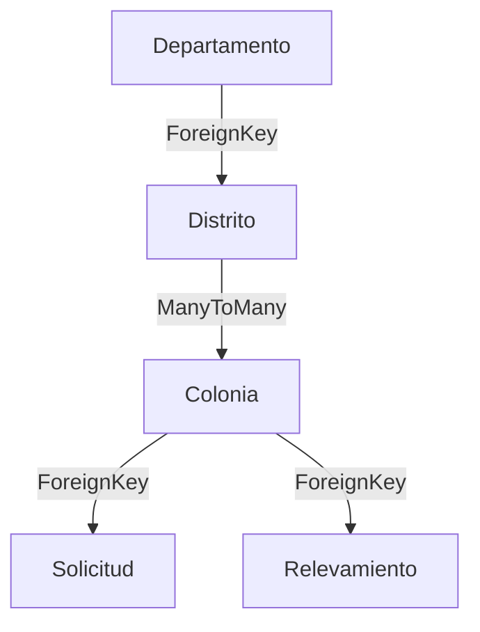

## Overview

The geographic data system organizes administrative divisions into a three-tier hierarchy: Departamento → Distrito → Colonia. Each level has automatic code generation, validation rules, and maintains referential integrity.

## Model Hierarchy



## Departamento Model

The top-level administrative division:

```python core/models.py:12
class Departamento(models.Model):
    nombre = models.CharField(max_length=200, unique=True, db_index=True)
    codigo = models.PositiveIntegerField(blank=True, null=True, unique=True)

    class Meta:
        verbose_name = "Departamento"
        verbose_name_plural = "Departamentos"
        ordering = ["codigo", "nombre"]
        
    def save(self, *args, **kwargs):
        if not self.codigo:
            # Get existing codes
            codigos_existentes = list(
                self.__class__.objects.exclude(codigo__isnull=True)
                .values_list("codigo", flat=True)
            )

            # Find first available number
            nuevo_codigo = 1
            while nuevo_codigo in codigos_existentes:
                nuevo_codigo += 1

            self.codigo = nuevo_codigo

        super().save(*args, **kwargs)

    def __str__(self):
        return self.nombre
```

### Key Features

<CardGroup cols={2}>
  <Card title="Unique Names" icon="fingerprint">
    Each department must have a unique name across the system
  </Card>
  <Card title="Auto-Generated Codes" icon="hashtag">
    Sequential numeric codes are automatically assigned
  </Card>
  <Card title="Database Indexing" icon="gauge">
    Name field is indexed for fast lookups
  </Card>
  <Card title="Natural Ordering" icon="arrow-down-1-9">
    Departments sort by code first, then name
  </Card>
</CardGroup>

## Distrito Model

Districts belong to departments and can have multiple colonies:

```python core/models.py:46
class Distrito(models.Model):
    nombre = models.CharField(max_length=200)
    departamento = models.ForeignKey(
        Departamento, on_delete=models.PROTECT, related_name="distritos"
    )
    codigo = models.PositiveIntegerField(blank=True, null=True, unique=False)
    
    class Meta:
        unique_together = ("nombre", "departamento")
        unique_together = ("codigo", "departamento")
        verbose_name = "Distrito"
        verbose_name_plural = "Distritos"
        ordering = ["departamento__nombre", "nombre"]

    def __str__(self):
        return f"{self.nombre} ({self.departamento.nombre})"
```

### Relationships and Constraints

<AccordionGroup>
  <Accordion title="Department Relationship" icon="link">
    Each district belongs to exactly one department via ForeignKey. The `PROTECT` on_delete ensures departments cannot be deleted while they have districts.
  </Accordion>
  
  <Accordion title="Unique Together Constraint" icon="shield-check">
    District names must be unique within a department (but can repeat across departments). Same rule applies to codes.
  </Accordion>
  
  <Accordion title="Non-Unique Codes" icon="code">
    Unlike departments, district codes are only unique within their department (`unique=False` globally).
  </Accordion>
</AccordionGroup>

<Warning>
The `unique_together` constraint appears twice with different fields. This is intentional: both `(nombre, departamento)` and `(codigo, departamento)` must be unique combinations.
</Warning>

## Colonia Model

Colonies (land settlements) can span multiple districts:

```python core/models.py:67
class Colonia(models.Model):
    ESTADO_CHOICES = [("activo", "Activo"), ("inactivo", "Inactivo")]

    nombre = models.CharField(max_length=250, db_index=True)
    finca_matriz = models.CharField(max_length=100, blank=True, null=True)
    padron_matriz = models.CharField(max_length=100, blank=True, null=True)
    distritos = models.ManyToManyField(Distrito, related_name="colonias")
    estado = models.CharField(
        max_length=20, choices=ESTADO_CHOICES, default="activo"
    )
    codigo = models.PositiveIntegerField(blank=True, null=True, unique=True)

    class Meta:
        unique_together = ("nombre",)
        verbose_name = "Colonia"
        verbose_name_plural = "Colonias"
        ordering = ["nombre"]

    def save(self, *args, **kwargs):
        if not self.codigo:
            codigos_existentes = list(
                self.__class__.objects.exclude(codigo__isnull=True)
                .values_list("codigo", flat=True)
            )
            nuevo_codigo = 1
            while nuevo_codigo in codigos_existentes:
                nuevo_codigo += 1
            self.codigo = nuevo_codigo
        super().save(*args, **kwargs)

    def clean(self):
        if self.pk:
            if self.distritos.count() == 0:
                raise ValidationError(
                    "La colonia debe estar asociada a al menos un distrito."
                )

    def __str__(self):
        return self.nombre
```

### ManyToMany Relationship

The colony-district relationship is many-to-many because:

<Steps>
  <Step title="Colonies can span multiple districts">
    A single colony may have land in several adjacent districts
  </Step>
  <Step title="Districts contain multiple colonies">
    Each district typically has many colonies within its boundaries
  </Step>
  <Step title="Flexible geographic representation">
    Allows accurate modeling of real-world administrative boundaries
  </Step>
</Steps>

```python
# Example: Creating a colony that spans two districts
colonia = Colonia.objects.create(nombre="Colonia Central")
colonia.distritos.add(distrito1, distrito2)

# Query all colonies in a district
distritos_colonias = distrito.colonias.all()

# Query all districts containing a colony
colonia_distritos = colonia.distritos.all()
```

### Colony-Specific Fields

<CardGroup cols={2}>
  <Card title="Finca Matriz" icon="map">
    Optional property registration number for the main land parcel
  </Card>
  <Card title="Padrón Matriz" icon="file-lines">
    Optional cadastral registration number
  </Card>
  <Card title="Estado" icon="toggle-on">
    Active/inactive status to manage colony lifecycle
  </Card>
</CardGroup>

## Validation Rules

### Colony Must Have Districts

The `clean()` method enforces business logic:

```python core/models.py:96
def clean(self):
    if self.pk:
        if self.distritos.count() == 0:
            raise ValidationError(
                "La colonia debe estar asociada a al menos un distrito."
            )
```

<Note>
This validation only runs for existing colonies (`if self.pk`). New colonies can be saved without districts initially, but must have at least one district before being considered valid.
</Note>

## Automatic Code Generation

All three models use the same pattern for code generation:

```python
def save(self, *args, **kwargs):
    if not self.codigo:
        # Get all existing codes
        codigos_existentes = list(
            self.__class__.objects.exclude(codigo__isnull=True)
            .values_list("codigo", flat=True)
        )
        
        # Find first available sequential number
        nuevo_codigo = 1
        while nuevo_codigo in codigos_existentes:
            nuevo_codigo += 1
        
        self.codigo = nuevo_codigo
    
    super().save(*args, **kwargs)
```

<Accordion title="How Code Generation Works">
  1. Check if object already has a code
  2. Query database for all existing codes (excluding nulls)
  3. Start from 1 and increment until finding an unused number
  4. Assign the new code
  5. Save the object

  This ensures:
  - No duplicate codes
  - No gaps in sequences (fills in deleted codes)
  - Codes can be manually set if needed
</Accordion>

## CRUD Operations

### Creating Geographic Hierarchy

```python
from core.models import Departamento, Distrito, Colonia

# Create department (code auto-generated)
departamento = Departamento.objects.create(
    nombre="Central"
)
print(departamento.codigo)  # 1

# Create district in department
distrito = Distrito.objects.create(
    nombre="Asunción",
    departamento=departamento,
    codigo=1
)

# Create colony and associate with district
colonia = Colonia.objects.create(
    nombre="San Lorenzo",
    finca_matriz="12345",
    padron_matriz="67890",
    estado="activo"
)
colonia.distritos.add(distrito)
```

### Querying Related Data

```python
# Get all districts in a department
distritos = departamento.distritos.all()

# Get all colonies in a district
colonias = distrito.colonias.filter(estado="activo")

# Get all districts for a colony
distritos_de_colonia = colonia.distritos.all()

# Query across relationships
from django.db.models import Count

# Departments with most districts
depts = Departamento.objects.annotate(
    num_distritos=Count('distritos')
).order_by('-num_distritos')

# Colonies spanning multiple districts
colonias_multidistrito = Colonia.objects.annotate(
    num_distritos=Count('distritos')
).filter(num_distritos__gt=1)
```

### Updating and Deleting

```python
# Update colony status
colonia.estado = "inactivo"
colonia.save()

# Add another district to colony
colonia.distritos.add(otro_distrito)

# Remove district association
colonia.distritos.remove(distrito)

# Delete with protection
try:
    departamento.delete()
except models.ProtectedError:
    # Cannot delete: has related districts
    print("Department has districts and cannot be deleted")
```

<Warning>
Departments cannot be deleted if they have related districts due to `on_delete=models.PROTECT`. You must delete or reassign all districts first.
</Warning>

## Database Optimization

### Indexes

```python
# Fields with db_index=True for fast lookups
Departamento.nombre  # Indexed
Colonia.nombre       # Indexed
```

### Ordering

```python
# Default ordering affects querysets and admin
Departamento: ["codigo", "nombre"]
Distrito: ["departamento__nombre", "nombre"]
Colonia: ["nombre"]
```

## Best Practices

<CardGroup cols={2}>
  <Card title="Always Set PROTECT" icon="shield">
    Use `on_delete=models.PROTECT` for ForeignKeys to prevent accidental data loss
  </Card>
  <Card title="Validate Before Save" icon="check-circle">
    Call `full_clean()` before saving to run validation logic
  </Card>
  <Card title="Use Related Names" icon="arrow-right-arrow-left">
    Explicit `related_name` makes reverse queries more readable
  </Card>
  <Card title="Index Frequently Queried Fields" icon="bolt">
    Add `db_index=True` to fields used in filters and lookups
  </Card>
  <Card title="Handle ManyToMany Carefully" icon="network-wired">
    Remember to save the object before calling `.add()` on ManyToMany fields
  </Card>
  <Card title="Document Code Patterns" icon="book">
    The sequential code pattern is reusable across other models
  </Card>
</CardGroup>