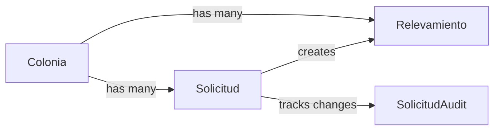
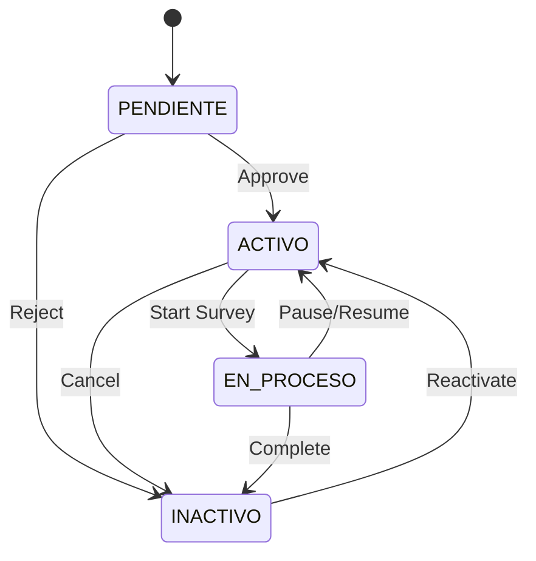

## Overview

The land survey system manages the lifecycle of survey requests and their execution through a state machine. Each colony can have survey requests that transition through defined states, with full audit logging of all changes.

## Model Architecture



## Solicitud Model

The survey request model manages the request lifecycle:

```python core/models.py:165
class Solicitud(models.Model):
    TIPO_CHOICES = [
        ("nuevo", "Nuevo relevamiento"),
        ("actualizacion", "Actualización de datos")
    ]
    
    ESTADO_PENDIENTE = "pendiente"
    ESTADO_ACTIVO = "activo"
    ESTADO_EN_PROCESO = "en_proceso"
    ESTADO_INACTIVO = "inactivo"
    
    ESTADOS = [
        (ESTADO_PENDIENTE, "Pendiente"),
        (ESTADO_ACTIVO, "Activo"),
        (ESTADO_EN_PROCESO, "En proceso de relevamiento"),
        (ESTADO_INACTIVO, "Inactivo"),
    ]

    colonia = models.ForeignKey(
        Colonia, 
        on_delete=models.CASCADE, 
        related_name="solicitudes"
    )
    tipo = models.CharField(
        max_length=20, 
        choices=TIPO_CHOICES, 
        default="nuevo"
    )
    estado = models.CharField(
        max_length=30, 
        choices=ESTADOS, 
        default=ESTADO_PENDIENTE
    )
    creado_por = models.ForeignKey(
        User, 
        on_delete=models.SET_NULL, 
        null=True, 
        blank=True, 
        related_name="solicitudes_creadas"
    )
    fecha_creacion = models.DateTimeField(default=timezone.now)
    fecha_actualizacion = models.DateTimeField(auto_now=True)
    observaciones = models.TextField(blank=True)

    class Meta:
        verbose_name = "Solicitud de relevamiento"
        verbose_name_plural = "Solicitudes de relevamiento"
        ordering = ["-fecha_creacion"]

    def __str__(self):
        return f"Solicitud #{self.pk} - {self.colonia} ({self.get_estado_display()})"
```

### Request Types

<CardGroup cols={2}>
  <Card title="Nuevo Relevamiento" icon="plus">
    First-time survey of a colony to collect baseline data
  </Card>
  <Card title="Actualización de Datos" icon="arrows-rotate">
    Follow-up survey to update previously collected information
  </Card>
</CardGroup>

## State Machine

Requests follow a strict state transition model:



### State Definitions

<AccordionGroup>
  <Accordion title="PENDIENTE - Awaiting Approval" icon="clock">
    Initial state when request is created. Coordinators review the request and decide whether to approve or reject.
    
    **Allowed transitions:**
    - `ACTIVO`: Request approved, ready for assignment
    - `INACTIVO`: Request rejected or withdrawn
  </Accordion>
  
  <Accordion title="ACTIVO - Approved and Ready" icon="check">
    Request has been approved and is ready for survey execution. Can be assigned to field teams.
    
    **Allowed transitions:**
    - `EN_PROCESO`: Field team starts survey work
    - `INACTIVO`: Request cancelled before survey begins
  </Accordion>
  
  <Accordion title="EN_PROCESO - Survey In Progress" icon="spinner">
    Active survey work is being conducted. Relevamiento records are created during this state.
    
    **Allowed transitions:**
    - `ACTIVO`: Survey paused or additional work needed
    - `INACTIVO`: Survey completed successfully
  </Accordion>
  
  <Accordion title="INACTIVO - Closed" icon="circle-xmark">
    Terminal state for completed, rejected, or cancelled requests. Can be reactivated if needed.
    
    **Allowed transitions:**
    - `ACTIVO`: Reactivate for additional work
  </Accordion>
</AccordionGroup>

## State Transition Control

The model enforces valid state transitions:

```python core/models.py:214
def puede_transicionar(self, nuevo_estado):
    allowed = {
        self.ESTADO_PENDIENTE: [self.ESTADO_ACTIVO, self.ESTADO_INACTIVO],
        self.ESTADO_ACTIVO: [self.ESTADO_EN_PROCESO, self.ESTADO_INACTIVO],
        self.ESTADO_EN_PROCESO: [self.ESTADO_ACTIVO, self.ESTADO_INACTIVO],
        self.ESTADO_INACTIVO: [self.ESTADO_ACTIVO],
    }
    return nuevo_estado in allowed.get(self.estado, [])
```

### Usage Example

```python
solicitud = Solicitud.objects.get(pk=1)

# Check if transition is allowed
if solicitud.puede_transicionar(Solicitud.ESTADO_ACTIVO):
    solicitud.estado = Solicitud.ESTADO_ACTIVO
    solicitud.save()
    
    # Log the transition
    SolicitudAudit.objects.create(
        solicitud=solicitud,
        previo="pendiente",
        nuevo="activo",
        cambiado_por=request.user,
        comentario="Solicitud aprobada por coordinador"
    )
else:
    raise ValidationError("Transición de estado no permitida")
```

<Warning>
Always check `puede_transicionar()` before changing state. Violating state machine rules can corrupt the workflow.
</Warning>

## Request Validation

The model includes validation to prevent duplicate active requests:

```python core/models.py:199
def clean(self):
    # Validate colony exists
    if not self.colonia:
        raise ValidationError(
            "La solicitud debe estar vinculada a una colonia."
        )
    
    # Prevent duplicates: same colony, same type, active state
    qs = Solicitud.objects.filter(colonia=self.colonia, tipo=self.tipo)
    if self.pk:
        qs = qs.exclude(pk=self.pk)
    
    if qs.filter(
        estado__in=[
            self.ESTADO_PENDIENTE, 
            self.ESTADO_ACTIVO, 
            self.ESTADO_EN_PROCESO
        ]
    ).exists():
        raise ValidationError(
            "Ya existe una solicitud activa o pendiente para esta colonia y tipo."
        )
```

<Info>
This validation prevents multiple concurrent requests for the same colony and type, ensuring clear workflow ownership.
</Info>

## SolicitudAudit Model

All state changes are logged for accountability:

```python core/models.py:224
class SolicitudAudit(models.Model):
    solicitud = models.ForeignKey(
        Solicitud, 
        on_delete=models.CASCADE, 
        related_name="auditorias"
    )
    previo = models.CharField(max_length=50)
    nuevo = models.CharField(max_length=50)
    cambiado_por = models.ForeignKey(
        User, 
        on_delete=models.SET_NULL, 
        null=True, 
        blank=True
    )
    fecha = models.DateTimeField(default=timezone.now)
    comentario = models.TextField(blank=True)

    class Meta:
        verbose_name = "Audit - Solicitud"
        verbose_name_plural = "Auditorías - Solicitudes"
        ordering = ["-fecha"]
```

### Audit Trail Example

```python
# View all changes to a request
audit_trail = solicitud.auditorias.all()

for audit in audit_trail:
    print(f"{audit.fecha}: {audit.previo} → {audit.nuevo}")
    print(f"  Changed by: {audit.cambiado_por.username}")
    print(f"  Comment: {audit.comentario}")

# Output:
# 2026-03-06 10:30: pendiente → activo
#   Changed by: coord_central
#   Comment: Solicitud aprobada por coordinador
# 2026-03-05 14:15: activo → en_proceso
#   Changed by: relevador_campo
#   Comment: Iniciando trabajo de campo
```

## Relevamiento Model

Survey execution records linked to requests:

```python core/models.py:242
class Relevamiento(models.Model):
    colonia = models.ForeignKey(
        Colonia, 
        on_delete=models.CASCADE, 
        related_name="relevamientos"
    )
    solicitud = models.ForeignKey(
        Solicitud, 
        on_delete=models.SET_NULL, 
        null=True, 
        blank=True, 
        related_name="relevamientos"
    )
    fecha = models.DateTimeField(default=timezone.now)
    datos = models.JSONField(blank=True, default=dict)
    realizado_por = models.ForeignKey(
        settings.AUTH_USER_MODEL, 
        on_delete=models.SET_NULL, 
        null=True, 
        blank=True
    )

    class Meta:
        verbose_name = "Relevamiento"
        verbose_name_plural = "Relevamientos"
        ordering = ["-fecha"]
        unique_together = ("colonia", "fecha")
```

### Flexible Data Storage

The `datos` JSONField allows flexible storage of survey data:

```python
relevamiento = Relevamiento.objects.create(
    colonia=colonia,
    solicitud=solicitud,
    realizado_por=request.user,
    datos={
        "poblacion_estimada": 1250,
        "viviendas_relevadas": 320,
        "servicios": {
            "agua": True,
            "electricidad": True,
            "alcantarillado": False
        },
        "coordenadas": [
            {"lat": -25.2637, "lng": -57.5759},
            {"lat": -25.2640, "lng": -57.5765}
        ],
        "observaciones": "Colonia en buen estado general"
    }
)
```

<Tip>
The JSONField structure can evolve over time without database migrations, making it ideal for flexible survey forms.
</Tip>

## Survey Validation

```python core/models.py:260
def clean(self):
    # Survey can only be created for requests in progress
    if self.solicitud and self.solicitud.estado != Solicitud.ESTADO_EN_PROCESO:
        raise ValidationError(
            "La solicitud asociada debe estar en estado 'En proceso de relevamiento'."
        )
    
    # Prevent duplicate surveys on same day
    recent = Relevamiento.objects.filter(colonia=self.colonia)
    if self.pk:
        recent = recent.exclude(pk=self.pk)
    
    today = timezone.now().date()
    if recent.filter(fecha__date=today).exists():
        raise ValidationError(
            "Ya existe un relevamiento para esta colonia en la fecha de hoy."
        )
```

<Warning>
Surveys can only be created when the associated request is in `EN_PROCESO` state. This ensures proper workflow sequencing.
</Warning>

## Complete Workflow Example

### 1. Create Survey Request

```python
from core.models import Solicitud, Colonia

# Coordinator creates new survey request
solicitud = Solicitud.objects.create(
    colonia=colonia,
    tipo="nuevo",
    creado_por=coordinador_user,
    observaciones="Primera vez relevando esta colonia"
)

print(solicitud.estado)  # "pendiente"
```

### 2. Approve Request

```python
if solicitud.puede_transicionar(Solicitud.ESTADO_ACTIVO):
    solicitud.estado = Solicitud.ESTADO_ACTIVO
    solicitud.save()
    
    # Log approval
    SolicitudAudit.objects.create(
        solicitud=solicitud,
        previo="pendiente",
        nuevo="activo",
        cambiado_por=gerente_user,
        comentario="Aprobado para relevamiento"
    )
```

### 3. Start Survey Work

```python
if solicitud.puede_transicionar(Solicitud.ESTADO_EN_PROCESO):
    solicitud.estado = Solicitud.ESTADO_EN_PROCESO
    solicitud.save()
    
    SolicitudAudit.objects.create(
        solicitud=solicitud,
        previo="activo",
        nuevo="en_proceso",
        cambiado_por=relevador_user,
        comentario="Equipo de campo iniciando relevamiento"
    )
```

### 4. Execute Survey

```python
from core.models import Relevamiento

relevamiento = Relevamiento(
    colonia=solicitud.colonia,
    solicitud=solicitud,
    realizado_por=relevador_user,
    datos={
        "viviendas": 150,
        "poblacion": 600,
        "servicios_basicos": True
    }
)

# Validate before saving
relevamiento.full_clean()  # Checks if solicitud is EN_PROCESO
relevamiento.save()
```

### 5. Complete Request

```python
if solicitud.puede_transicionar(Solicitud.ESTADO_INACTIVO):
    solicitud.estado = Solicitud.ESTADO_INACTIVO
    solicitud.save()
    
    SolicitudAudit.objects.create(
        solicitud=solicitud,
        previo="en_proceso",
        nuevo="inactivo",
        cambiado_por=coordinador_user,
        comentario="Relevamiento completado exitosamente"
    )
```

## Querying Survey Data

```python
# Get all active requests
active_requests = Solicitud.objects.filter(
    estado__in=[
        Solicitud.ESTADO_PENDIENTE,
        Solicitud.ESTADO_ACTIVO,
        Solicitud.ESTADO_EN_PROCESO
    ]
)

# Get all surveys for a colony
surveys = Relevamiento.objects.filter(colonia=colonia)

# Get requests created by a user
user_requests = Solicitud.objects.filter(creado_por=user)

# Get surveys performed by a user
user_surveys = Relevamiento.objects.filter(realizado_por=user)

# Get audit trail for a request
audit_history = solicitud.auditorias.select_related('cambiado_por').all()

# Get all surveys linked to a request
request_surveys = solicitud.relevamientos.all()
```

## Best Practices

<CardGroup cols={2}>
  <Card title="Always Validate Transitions" icon="shield-check">
    Use `puede_transicionar()` before changing state to maintain workflow integrity
  </Card>
  <Card title="Create Audit Records" icon="clipboard-list">
    Log every state change with user and reason for full accountability
  </Card>
  <Card title="Check Request State" icon="circle-check">
    Validate that solicitud is in `EN_PROCESO` before creating Relevamiento
  </Card>
  <Card title="Use JSONField Wisely" icon="brackets-curly">
    Structure survey data consistently for easier querying and reporting
  </Card>
  <Card title="Prevent Duplicates" icon="copy">
    Call `full_clean()` before saving to enforce uniqueness constraints
  </Card>
  <Card title="Track Ownership" icon="user">
    Always set `creado_por` and `realizado_por` for audit purposes
  </Card>
</CardGroup>