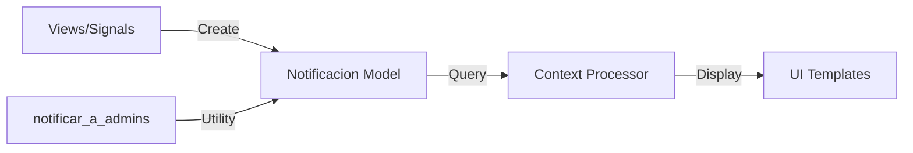

## Overview

The notification system provides real-time alerts to administrators about important system events. Notifications are stored in the database, displayed in the UI, and can include links to relevant pages.

## Architecture

The notification system consists of three main components:



## Notificacion Model

Notifications are stored in the database:

```python core/notificaciones/models.py:4
class Notificacion(models.Model):
    TIPOS = (
        ("INFO", "Información"),
        ("WARNING", "Advertencia"),
        ("SUCCESS", "Éxito"),
        ("ERROR", "Error"),
    )

    usuario = models.ForeignKey(
        settings.AUTH_USER_MODEL,
        on_delete=models.CASCADE,
        related_name="notificaciones"
    )
    mensaje = models.TextField()
    tipo = models.CharField(max_length=20, choices=TIPOS, default="INFO")
    leida = models.BooleanField(default=False)
    creado = models.DateTimeField(auto_now_add=True)
    link = models.CharField(max_length=255, blank=True, null=True)

    class Meta:
        ordering = ["-creado"]

    def __str__(self):
        return f"{self.tipo} - {self.mensaje[:30]}"
```

### Notification Types

<CardGroup cols={2}>
  <Card title="INFO" icon="circle-info" color="#0ea5e9">
    General information about system events (user created, role assigned, etc.)
  </Card>
  <Card title="WARNING" icon="triangle-exclamation" color="#f59e0b">
    Alerts about important changes (user deactivated, role edited, etc.)
  </Card>
  <Card title="SUCCESS" icon="circle-check" color="#10b981">
    Confirmation of successful operations (user activated, request approved, etc.)
  </Card>
  <Card title="ERROR" icon="circle-xmark" color="#ef4444">
    Critical errors requiring immediate attention
  </Card>
</CardGroup>

## Creating Notifications

### Using notificar_a_admins Utility

The primary method for creating notifications:

```python core/notificaciones/utils.py:6
def notificar_a_admins(mensaje, tipo="INFO", exclude_user=None, link=None):
    """
    Creates notifications for all administrators, except the user who performed the action.
    """
    admins = User.objects.filter(is_superuser=True)

    for admin in admins:
        if exclude_user and admin == exclude_user:
            continue
        Notificacion.objects.create(
            usuario=admin,
            mensaje=mensaje,
            tipo=tipo,
            link=link
        )
```

### Parameters

| Parameter | Type | Required | Description |
|-----------|------|----------|-------------|
| `mensaje` | string | Yes | The notification message text |
| `tipo` | string | No | Notification type: INFO, WARNING, SUCCESS, ERROR (default: INFO) |
| `exclude_user` | User | No | User who triggered the action (won't receive notification) |
| `link` | string | No | Optional URL to link notification to relevant page |

<Info>
The `exclude_user` parameter prevents users from receiving notifications about their own actions, reducing notification noise.
</Info>

## Usage Examples

### User Management Events

```python administrador/views.py:297
# Notify when admin creates new user
notificar_a_admins(
    mensaje=f'Se ha registrado a: "{self.object.username}".',
    tipo="INFO",
    exclude_user=self.request.user,
    link=reverse("administrador_dashboard")
)
```

```python administrador/views.py:337
# Notify when role is assigned
notificar_a_admins(
    mensaje=f'El usuario {usuario.username} fue asignado al rol "{rol.nombre}".',
    tipo="INFO",
    exclude_user=request.user
)
```

```python administrador/views.py:375
# Notify when user state changes
notificar_a_admins(
    mensaje=f'El estado del usuario {user.username} fue cambiado a "{user.estado}"',
    tipo="WARNING" if user.estado == "INACTIVO" else "SUCCESS",
    exclude_user=request.user,
    link=reverse("administrador_dashboard")
)
```

### Role Management Events

```python administrador/views.py:237
# Notify when new role is created
notificar_a_admins(
    mensaje=f'Se ha creado un nuevo rol: "{rol.nombre}".',
    tipo="INFO",
    exclude_user=self.request.user,
    link=reverse("listar_roles")
)
```

```python administrador/views.py:264
# Notify when role is edited
notificar_a_admins(
    mensaje=f'El rol "{rol.nombre}" fue editado.',
    tipo="WARNING",
    exclude_user=request.user
)
```

### Pattern: Conditional Notification Type

```python
# Dynamic notification type based on action
notificar_a_admins(
    mensaje=f'Estado actualizado: {estado}',
    tipo="WARNING" if estado == "INACTIVO" else "SUCCESS",
    exclude_user=request.user
)
```

## Context Processor

Notifications are made available to all templates:

```python core/notificaciones/context_processors.py:3
def notificaciones_context(request):
    if request.user.is_authenticated:
        return {
            "notificaciones_no_leidas": Notificacion.objects.filter(
                usuario=request.user, leida=False
            ).count(),
            "notificaciones_recientes": Notificacion.objects.filter(
                usuario=request.user
            ).order_by("-creado")[:5]  # Last 5 notifications
        }
    return {}
```

### Available Context Variables

<ParamField path="notificaciones_no_leidas" type="int">
  Count of unread notifications for the current user
</ParamField>

<ParamField path="notificaciones_recientes" type="QuerySet">
  Last 5 notifications for the current user, ordered by creation date
</ParamField>

## Template Integration

Notifications can be displayed in templates:

```django
<!-- Display unread count -->
<span class="badge bg-danger">{{ notificaciones_no_leidas }}</span>

<!-- Display recent notifications -->
<div class="notifications-dropdown">
  
    <div class="notification-item notification-{{ notif.tipo|lower }}">
      <div class="notification-message">
        
          <a href="{{ notif.link }}">{{ notif.mensaje }}</a>
        
          {{ notif.mensaje }}
        
      </div>
      <div class="notification-time">
        {{ notif.creado|timesince }} ago
      </div>
      
        <span class="badge badge-new">New</span>
      
    </div>
  
    <p class="text-muted">No hay notificaciones</p>
  
</div>
```

## Managing Notifications

### Mark as Read

```python
# Mark single notification as read
notificacion = Notificacion.objects.get(pk=notification_id)
notificacion.leida = True
notificacion.save()

# Mark all notifications as read for a user
Notificacion.objects.filter(
    usuario=request.user, 
    leida=False
).update(leida=True)
```

### Query Notifications

```python
from django.utils import timezone
from datetime import timedelta

# Get unread notifications
unread = Notificacion.objects.filter(
    usuario=user, 
    leida=False
)

# Get notifications from last 24 hours
recent = Notificacion.objects.filter(
    usuario=user,
    creado__gte=timezone.now() - timedelta(days=1)
)

# Get notifications by type
warnings = Notificacion.objects.filter(
    usuario=user,
    tipo="WARNING"
)

# Get notifications with links
actionable = Notificacion.objects.filter(
    usuario=user,
    link__isnull=False
)
```

### Delete Old Notifications

```python
from datetime import timedelta
from django.utils import timezone

# Delete notifications older than 30 days
old_date = timezone.now() - timedelta(days=30)
Notificacion.objects.filter(
    creado__lt=old_date,
    leida=True
).delete()
```

## AJAX Notification Updates

Example endpoint for marking notifications as read:

```python
from django.http import JsonResponse
from django.views.decorators.http import require_POST

@require_POST
@login_required
def marcar_leida(request, notificacion_id):
    try:
        notificacion = Notificacion.objects.get(
            pk=notificacion_id,
            usuario=request.user
        )
        notificacion.leida = True
        notificacion.save()
        
        unread_count = Notificacion.objects.filter(
            usuario=request.user,
            leida=False
        ).count()
        
        return JsonResponse({
            'success': True,
            'unread_count': unread_count
        })
    except Notificacion.DoesNotExist:
        return JsonResponse({
            'success': False,
            'message': 'Notificación no encontrada'
        }, status=404)
```

## Best Practices

<CardGroup cols={2}>
  <Card title="Use Appropriate Types" icon="palette">
    Choose notification types that match the severity: INFO for routine events, WARNING for important changes, ERROR for failures
  </Card>
  <Card title="Exclude Actors" icon="user-slash">
    Always pass `exclude_user` to prevent users from seeing notifications about their own actions
  </Card>
  <Card title="Provide Context Links" icon="link">
    Include `link` parameter to help users navigate to relevant pages for action
  </Card>
  <Card title="Keep Messages Concise" icon="message">
    Write clear, actionable notification messages that explain what happened
  </Card>
  <Card title="Clean Up Old Data" icon="broom">
    Periodically delete old read notifications to maintain performance
  </Card>
  <Card title="Batch Updates" icon="layer-group">
    Use `update()` for bulk operations like marking all as read instead of individual saves
  </Card>
</CardGroup>

## Common Patterns

### Creating Notifications in Signals

```python
from django.db.models.signals import post_save
from django.dispatch import receiver
from core.notificaciones.utils import notificar_a_admins

@receiver(post_save, sender=Solicitud)
def notify_new_solicitud(sender, instance, created, **kwargs):
    if created:
        notificar_a_admins(
            mensaje=f'Nueva solicitud creada para {instance.colonia.nombre}',
            tipo="INFO",
            link=reverse('solicitud_detail', args=[instance.pk])
        )
```

### Role-Based Notifications

```python
from administrador.models import User, Rol

def notificar_a_rol(rol_nombre, mensaje, tipo="INFO", link=None):
    """
    Notify all users with a specific role.
    """
    rol = Rol.objects.get(nombre=rol_nombre)
    usuarios = User.objects.filter(rol=rol, estado="ACTIVO")
    
    for usuario in usuarios:
        Notificacion.objects.create(
            usuario=usuario,
            mensaje=mensaje,
            tipo=tipo,
            link=link
        )

# Usage
notificar_a_rol(
    rol_nombre="Coordinador",
    mensaje="Nueva solicitud requiere aprobación",
    tipo="WARNING",
    link=reverse('solicitudes_pendientes')
)
```

### Custom Notification Queries

```python
class NotificationManager(models.Manager):
    def unread_for_user(self, user):
        return self.filter(usuario=user, leida=False)
    
    def recent_for_user(self, user, days=7):
        cutoff = timezone.now() - timedelta(days=days)
        return self.filter(usuario=user, creado__gte=cutoff)
    
    def urgent_for_user(self, user):
        return self.filter(
            usuario=user,
            tipo__in=["WARNING", "ERROR"],
            leida=False
        )

# Add to Notificacion model
class Notificacion(models.Model):
    # ... fields ...
    objects = NotificationManager()

# Usage
urgent = Notificacion.objects.urgent_for_user(request.user)
```

## Performance Considerations

<Tip>
Use `select_related('usuario')` when querying notifications to reduce database queries in list views.
</Tip>

```python
# Efficient notification loading
notifications = Notificacion.objects.filter(
    usuario=user
).select_related('usuario')[:10]
```

<Warning>
The context processor runs on every request. Keep queries efficient by limiting results and using appropriate indexes.
</Warning>